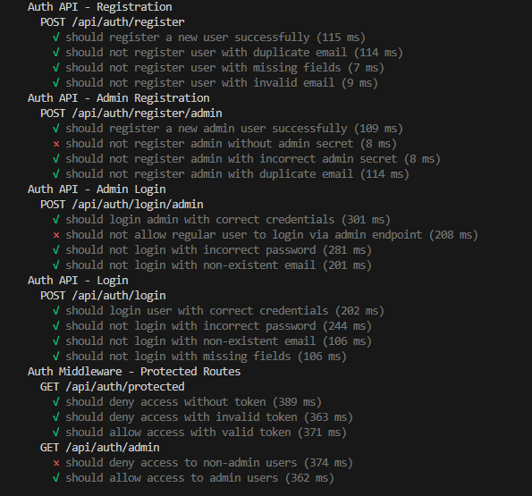

# Sweet Shop Management System 🍬

A full-stack Sweet Shop Management System built with modern web technologies. This application allows users to browse and purchase sweets, while administrators can manage inventory, restock items, and track product details.

This project was built following strict **Test-Driven Development (TDD)** principles and adheres to Clean Architecture standards.

---

## 🚀 Tech Stack

### Backend
* **Runtime:** Node.js
* **Language:** TypeScript
* **Framework:** Express.js
* **Database:** MongoDB (with Mongoose)
* **Authentication:** JWT (JSON Web Tokens)
* **Testing:** Jest & Supertest

### Frontend
* **Framework:** React.js (Vite)
* **Styling:** Tailwind CSS
* **State Management:** React Context API (`useContext`)
* **HTTP Client:** Axios

---

## 📡 API Endpoints

The backend exposes the following RESTful API endpoints as per the project requirements:

### 🔐 Authentication
* `POST /api/auth/register` - Register a new user [cite: 14]
* `POST /api/auth/login` - Login and receive a JWT [cite: 14]

### 🍬 Sweets Management
* `GET /api/sweets` - View a list of all available sweets [cite: 17]
* `GET /api/sweets/search` - Search for sweets by name, category, or price range 
* `POST /api/sweets` - Add a new sweet (Protected) [cite: 16]
* `PUT /api/sweets/:id` - Update a sweet's details (Protected) [cite: 19]
* `DELETE /api/sweets/:id` - Delete a sweet (Admin only) [cite: 20]

### 📦 Inventory Control
* `POST /api/sweets/:id/purchase` - Purchase a sweet, decreasing its quantity. 
* `POST /api/sweets/:id/restock` - Restock a sweet, increasing its quantity(Admin only).

---

## 🛠️ Setup & Installation

Follow these instructions to set up and run the project locally.

### Prerequisites
* Node.js (v16+)
* MongoDB (Local or Atlas URL)
* Git

### 1. Backend Setup
1.  Navigate to the backend directory:
    ```bash
    cd backend
    ```
2.  Install dependencies:
    ```bash
    npm install
    ```
3.  Create a `.env` file in the `backend` root and add your configuration:
    ```env
    PORT=5000
    MONGO_URI=mongodb://localhost:27017/sweetshop
    JWT_SECRET=your_super_secret_key
    ```
4.  Run the development server:
    ```bash
    npm run dev
    ```
    *The API will be available at `http://localhost:5000`.*

### 2. Frontend Setup
1.  Open a new terminal and navigate to the frontend directory:
    ```bash
    cd frontend
    ```
2.  Install dependencies:
    ```bash
    npm install
    ```
3.  Run the development server:
    ```bash
    npm run dev
    ```
4.  Open your browser and navigate to the URL shown (usually `http://localhost:5173`).

---

## 🧪 Testing & TDD

This project follows **Test-Driven Development (TDD)**. [cite_start]The backend logic was written using a Red-Green-Refactor loop[cite: 36, 37].

To run the test suite (Backend):

```bash
cd backend
npm test

```

## 🧪 Test Report

*(See `screenshots/test-results.png` for visual proof of the test suite execution)*

The test suite covers:
* **User Registration & Login (Auth)**
* **Sweet CRUD Operations** (Create, Read, Update, Delete)
* **Inventory Logic** (Purchase transaction and Restocking)

---

## 🤖 My AI Usage

*Per the assignment requirements, I am being transparent about my use of AI tools in this project.*

### Tools Used
* **Google Gemini**

### How I Used AI
I used **Google Gemini** specifically to assist with the **Testing Scripts**.

* I referenced Gemini to generate the initial boilerplate syntax for Jest and Supertest, ensuring my test cases were structured correctly before implementing the backend logic.
* I used it to understand how to mock specific MongoDB database responses for edge cases (like handling transaction failures).
* **Note:** The core application logic, frontend implementation, and architectural decisions were implemented manually to ensure I fully understood the system flow.

### Reflection
Using AI for the testing phase allowed me to focus more on the logic and business rules of the application rather than getting stuck on testing framework configuration. It streamlined the TDD process by providing a solid foundation for my "Red" (failing) tests.

---

## 📸 Screenshots

*(Screenshots of the final application in action)*

### Dashboard View

*Displays all sweets with search and filter options.*

### Admin Panel

*Interface for adding, updating, and restocking sweets.*

### Test Execution Report



*Evidence of passing or failing test suite.*
